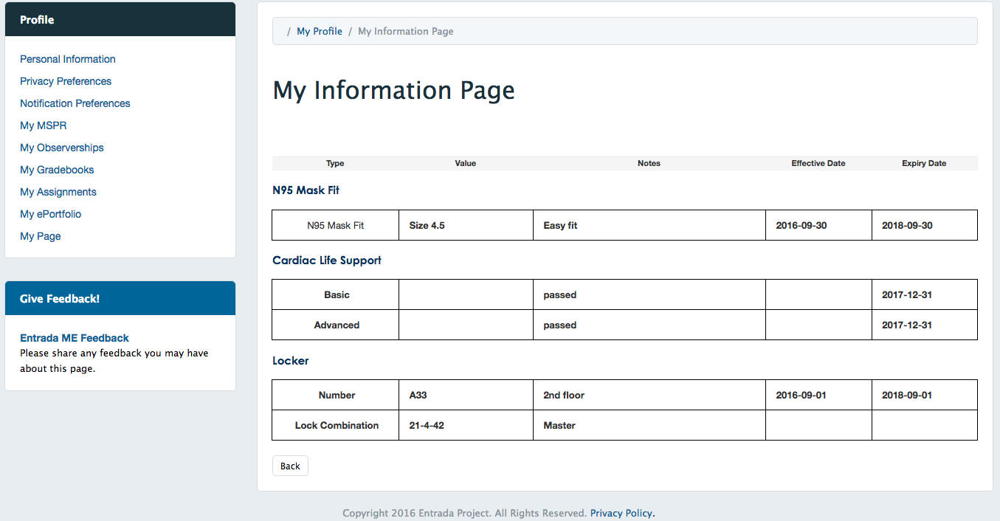
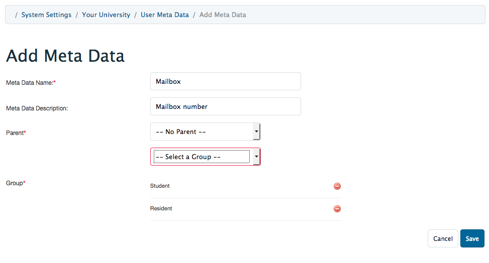
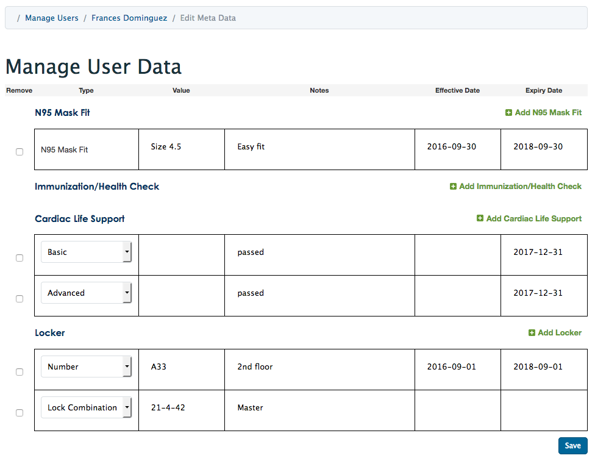
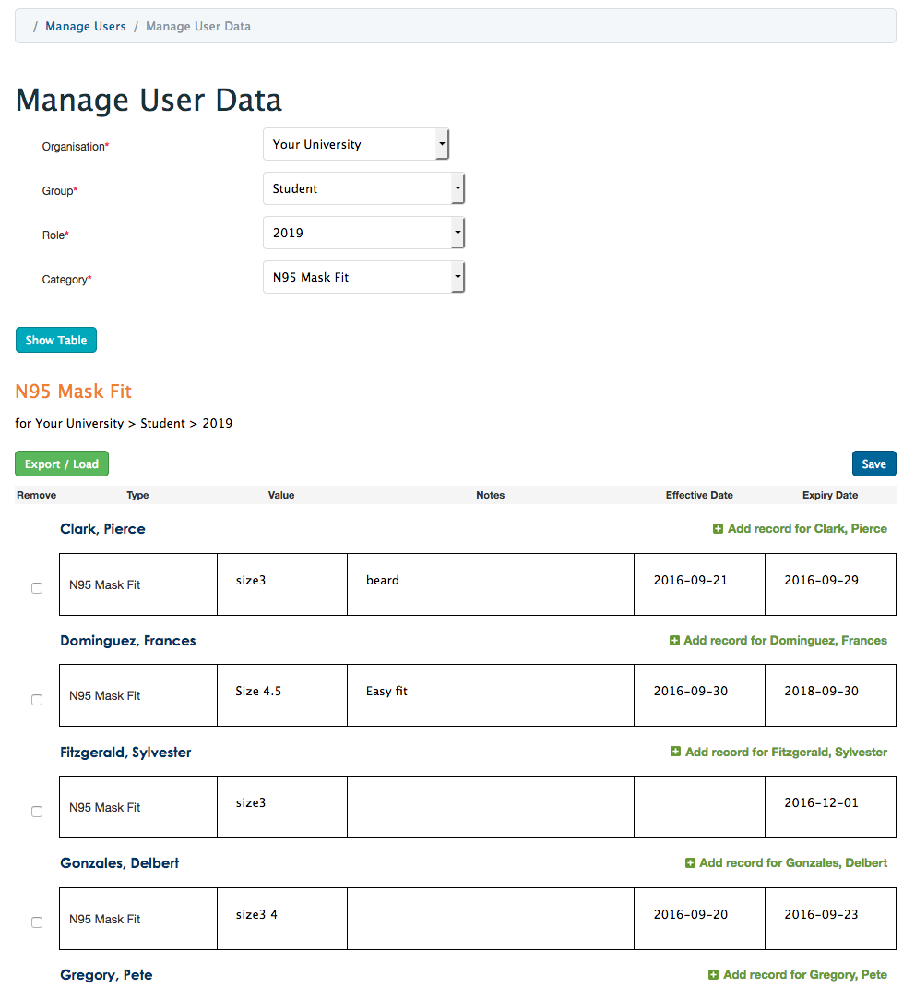
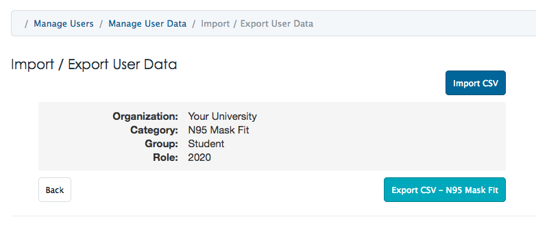
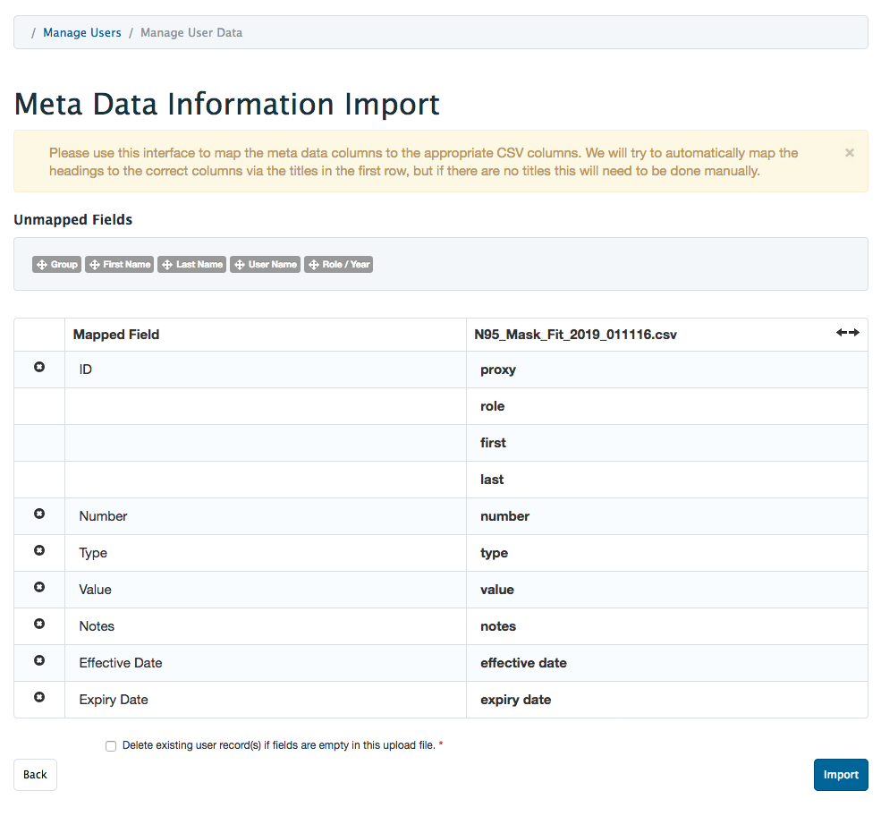

# Metadata Module 

**Provide students with a general, non-curricular information page: "meta-data".
The information item types are created by system administrators and the data is maintained by the user administrators. **

## Overview

The Metadata module provides a mechanism for adminstration to provide users with other types information that they need. Users access this information from the meta data (*MyPage*) link on their Profile page.
The data items are displayed to the users in one tabular form with standard fields.

**System administrators**, from the System settings page, create the individual types (meta data) for at least one or more groups: students, lecturers, staff...

The item types can have none or **one level** of sub types. The sub types inherit their group relationships from the parent.

**User administrators** can add, edit, and delete individual user information.

**User administrators** can add, edit, delete, export and upload user information by group.

User data can be imported or exported by group and type.

The import csv file can have any associated fields mapped to associated input fields.

User identification will be acsertained from any combination proxy_id, number and name when present. 

## Technical

#### Tables

- entrada/meta_types
- entrada/meta_relations
- entrada/meta_values
- entrada_auth/acl_permissions

#### Summary Process

- System administrators create edit organisation meta types for user groups.
    - access from administrators 'System Settings' page.
    - create an idividual or top (parent) type item.
    - add at least one group (relation) to this type.
    - add any number of new children types when needed to the parent type. 
- User administrators load, add, and edit users data.
    - access from administrators 'Manage Users' page.
    - make selection and click 'Show Table'.
    - add / edit individual(s) user metadata.
    - group data can be exported or bulk uploaded.
        - click on 'Export / Load' button
        - to import group data in bulk from csv file select 'Import CSV' . 
            - select a local file.
            - match pertinent fields.
                 - the Type field is used to identify the children(s) records.
            - by default exisiting user records are replaced with new data.
            - if 'Delete existing..' is selected: existing records will be deleted if the user data fields are empty. 
        - to export / download to a csv file select 'Export CSV - '.
- Users view their meta data from the MyPage link on the Profile page.

For more information please visit our website: [http://www.entrada-project.org](http://www.entrada-project.org)

