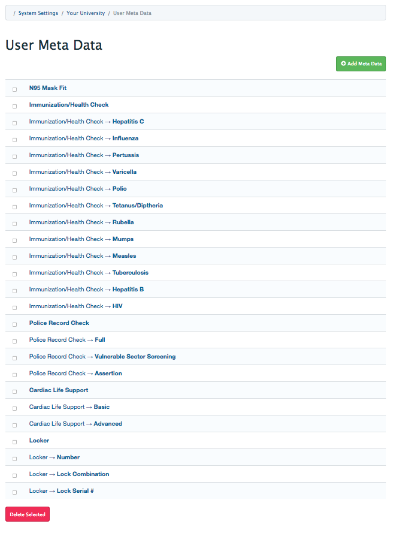
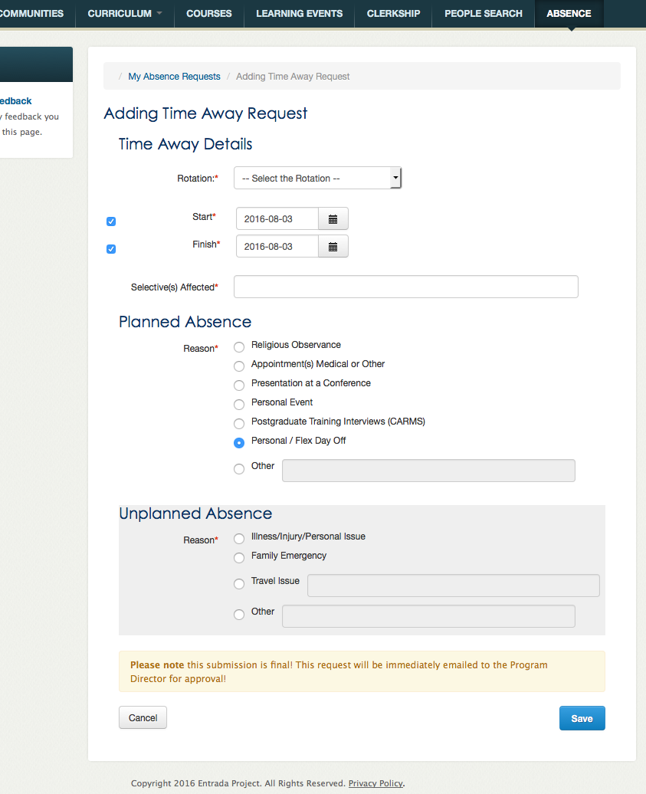
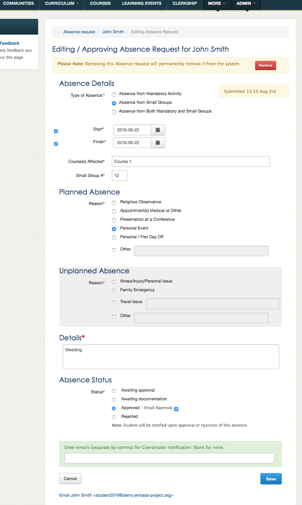
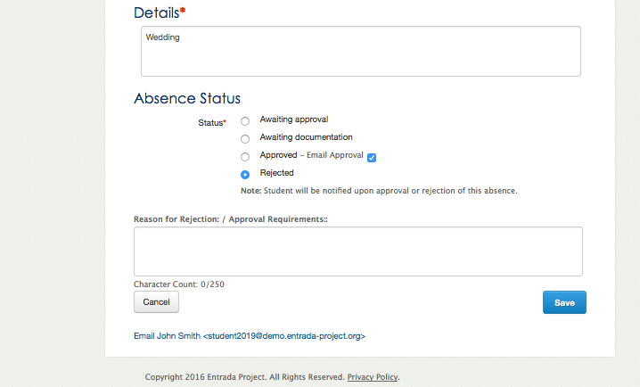

# Metadata Module 

**Provide students with a general, non-curricular information page (*MyPage*).
The information item types are created by system administrators and the data is maintained by the user administrators. **

## Overview

The Absence module provides a mechanism for students: preclerkship and clerkship to submit an absence request to the UME office and clerkship departments respectively.
Once processed by the UME coordinator(s) or the clerkship department an email is automatically sent to the student informing them of the success, failure, or request for more information.

Preclerkship (**Absence**) requests and clerkship (**Time Away**) requests when submitted are displayed as pending requests on the coordinators' *Manage Absence* page.   Clerkship directors and assigned adminstrators are emailed the requests.

Coordinators access the absence administration module via the *Manage Absence* page to view and edit pending requests and to print class absence reports.

## The students' absence request forms:

The entry forms have three sections: a Details section: when and what is being affected, a Planned and a Unplanned sections:  to describe the reason of the absence.

All reasons require *Details* (an explanation), **except** the **_Personal / Flex Day Off_** which is a special type of absence requiring no explanation but is limited in number, (*eg; 3 per term and 1 per clerkship rotation*).

### Pre-clerkship

**Note:**
  The *Courses* and *Selectives (time away) Affected* is a free text field. *Small Group* numbers is a free text integer field.

### Clerkship

- Time Away requests are also automatically emailed to the clerkship director(s) and assigned persons for their perusal and approval. The departments/directors forward their response by email to the  *mandatory* clerkship coordinator for processing and to the student.
- Time Away requests from clerkship electives are vetted by the *mandatory clerkship* coordinator.

## Management

###Approval

Addition coordinators and others, if need be, can be sent notification of the absence request approval.

###Reject

Rejection reason or request for more documentation text note is emailed to student.

## Technical

#### Tables

- entrada/settings
- entrada/meta_types
- entrada/meta_relations
- entrada/meta_values
- entrada_auth/acl_permissions

All absence text and ***absence reasons*** are maintained in the language file.

	/*
	* Absences Reasons 
	*/
	"absences_reasons" => array (
		1 => "Religious Observance",
		2 => "Appointment(s) Medical or Other",
		3 => "Presentation at a Conference",
		4 => "Personal Event",
		5 => "Other",
		6 => "Illness/Injury/Personal Issue",
		7 => "Family Emergency",
		8 => "Travel Issue",
		9 => "Other",
		11 => "Postgraduate Training Interviews (CARMS)",
		12 => "Personal / Flex Day Off",
	),

The absence reasons correspond by index to absence values in the settings table. 

#### Settings table values

Absence settings values are used in control and display of the absence module pages.

name |   value   |  purpose
---- | :---------: | :---------
absence_clerkship_elective | 99 | rotation value assigned to electives
absence_personal_days_max | 3 | maximum personal days per term
absence_personal_days_max_rotation | 1 | maximum personal days per clerkship rotation
absence_reason_explanation | 5,8,9 | reasons requiring an explanation
absence_reason_personal_day | 12 | reason - personal / flex day
absence_reason_planned | 1,2,3,4,12,5 | reasons - planned 
absence_reason_planned_timeaway | 1,2,3,4,11,12,5 | reasons - planned clerkship
absence_reason_health | 6 | reason - health issues
absence_reason_travel |  8 | reason - travel issues
absence_reason_unplanned | 6,7,8,9 | reasons - unplanned
absence_sendmail | true | false, or debug: to dump mail objects via alert box 

Set the *absence_sendmail* setting to **debug** to display the email objects without actually sending them out.

#### Settings file values

    $AGENT_CONTACTS["agent-absence"] = array("name" => "Absence Coordinator", "email" => "coordinator@uschool.edu", "admin_ids" => array(0));                   // Preclerkship absence coordinator
    $AGENT_CONTACTS["agent-clerkship-mandatory"] = array("name" => "Clerkship Coordinator", "email" => "clerkship@uschool.edu", "director_ids" => array(0));    // Clerkship coordinator
    $AGENT_CONTACTS["agent-clerkship-contacts"]["Anesthesia"] = array("name" => "Anesthesia Person", "email" => "anesthesia@uschool.edu");                      // Rotational clerkship contacts, if needed
    $AGENT_CONTACTS["agent-clerkship-contacts"]["Internal Medicine"] = array("name" => "Internal Medicine Person", "email" => "im@uschool.edu");

	/**
  	 * Four year program
	 */
    $CLASSES_START = array( "fourth Monday of August",       // Start of first year pre clerkship year
                            "fourth Monday of August",       // Start of second year pre clerkship year
                            "second Monday of August",      // Start of third year pre clerkship / clerkship year
                            "first  Monday of August");     // Start of fourth year clerkship year
    $CLERKSHIP_START         = array("day" => "first Monday of January", "year" => 1);  // Clerkship starts on 'day' in 'year'(s) before graduation
    $CLERKSHIP_ABSENCE_START = array("day" => "first Monday of September","year" => 2);  // Clerkship absence entry for pre-clerks starts on 'day' in 'year'(s) before graduation
    
    $MODULES["absence"] = array("title" => "Manage Absences", "resource" => "absence", "permission" => "update");
    
    /**
     * Used to cap the number of Clerkship rotations which are allowed in the system.
     */
    define("MAX_ROTATION", 10);
    
The Absence module uses the above items from the settings file to determine in where in the school's program the student is currently in and who are the appropriate contacts.

#### Summary Process

- Provides an online form for students and clerks to submit an absence request.
- Check and prevent that the number of *Personal / Flex day(s)* are not exceeded.
- Provides an administrative interface for absence and clerkship administrators to process requests.
- Sends automated emails to students and clerkship administrators.
- Provides absence report output.

For more information please visit our website: [http://www.entrada-project.org](http://www.entrada-project.org)

